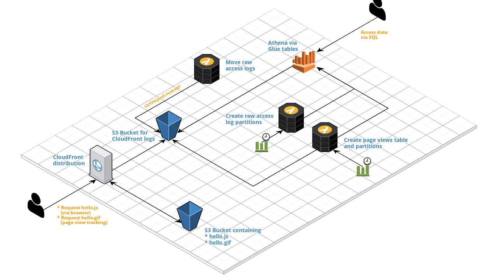

# ownstats
Host your own privacy-effective website statistics on AWS via CloudFront, S3, Glue and Athena.

## Architecture

[]()

### What is provisioned in your AWS account?
* A S3 bucket containing the assets for gathering website statistics (`hello.js` and `hello.gif`)
* A S3 bucket for the CloudFront CDN logs
* A CloudFront distribution for global hosting of the assets via CDN
* A Lambda function for automatic movement of the raw CloudFront logs into a folder structure which benefits Athena partitioning (see [functions/moveAccessLogs.js](https://github.com/ownstats/ownstats/blob/master/functions/moveAccessLogs.js))
* A Lambda function which creates Athena partitions for the raw CloudFront logs (see [functions/createPartition.js](https://github.com/ownstats/ownstats/blob/master/functions/createPartition.js))
* A Lambda function which transforms the raw CloudFront logs into a page view table, and also creates the relevant Athena partitions (see [functions/transformPageViews.js](https://github.com/ownstats/ownstats/blob/master/functions/transformPageViews.js))
* A set of Glue tables  
  * `access_logs`: Holds the raw CloudFront logs
  * `page_views`: Contains the page views derived from `access_logs`
  * `edge_locations`: A list of CloudFront edge location, which can be used to get approximate location info for the `page_views` table (as IP information is dropped). See below for some usage information.

## Preconditions
This guide assumes that you have an install of [Serverless](https://www.serverless.com) on your machine. Furthermore, you'll need an AWS account enabled to run/deploy the above mentioned services, as well as already set up [AWS credentials](https://serverless.com/framework/docs/providers/aws/guide/credentials/) on your local machine.

## How-to 
To use `ownstats` on your websites, you can follow the steps below to get started.

### Set up a Serverless project
There are basically two ways to get started, either use [Serverless](https://www.serverless.com) to generate a basic project structure, or use the "traditional" fork and clone mechanisms.

#### Use Serverless templates
The following command will create a local project structure you can use to deploy your static website in the `ownstats-mywebsite` folder relative to your current working directory:

```bash
$ sls create --template-url https://github.com/ownstats/ownstats --path ownstats-mywebsite
Serverless: Generating boilerplate...
Serverless: Downloading and installing "ownstats"...
Serverless: Successfully installed "ownstats"
```

**Hint**  
When using this method, Serverless is replacing the `service.name` in the `serverless.yml` file automatically with `ownstats-mywebsite`. If you want to use a different stack name, you have to replace it manually. You also need to take care of that the stack name is using only allowed characters. When using the "Fork and clone" method below, the stack name is automatically derived from the domain name and sanitized regarding the allowed characters.

#### Fork and clone
Once you forked the repo on GitHub, you can clone it locally via

```bash
$ git clone git@github.com:youraccount/yourrepo.git
```

where `youraccount/yourrepo` needs to be replaced with the actual repository name of your forked repo.

### Install dependencies
To install the dependencies, do a 

```bash
$ npm i
```

After that, the project is usable.

### Deploy
You can deploy `ownstats` with the following command:

```bash
$ sls deploy --domain yourdomain.yourtld --stage dev
```

where `yourdomain.yourtld` needs to be replaced with your actual domain name. You can also specify a AWS region via the `--region` flag, otherwise `us-east-1` will be used. Furthermore, you can enable a debug mode for `hello.js` by specifying `--debug-mode true`.

**Example output**
```text
Serverless: Packaging service...
Serverless: Excluding development dependencies...
Serverless: Uploading CloudFormation file to S3...
Serverless: Uploading artifacts...
Serverless: Uploading service ownstats-yourdomain-yourtld.zip file to S3 (1.79 MB)...
Serverless: Validating template...
Serverless: Updating Stack...
Serverless: Checking Stack update progress...
.....................
Serverless: Stack update finished...
Service Information
service: ownstats-yourdomain-yourtld
stage: dev
region: us-east-1
stack: ownstats-yourdomain-yourtld-dev
resources: 24
api keys:
  None
endpoints:
  None
functions:
  transformPageViews: ownstats-yourdomain-yourtld-dev-transformPageViews
  createPartition: ownstats-yourdomain-yourtld-dev-createPartition
  moveAccessLogs: ownstats-yourdomain-yourtld-dev-moveAccessLogs
layers:
  None
Serverless: Stack Output processed with handler: modules/renderScript.handler
Serverless: Minified hello.js
Serverless: Compressed hello.js
Serverless: Written hello.js template: /Users/username/development/ownstats-yourdomain-yourtld/src/hello.js
Serverless: Tracking pixel URL: https://d1h3biw9kbtest.cloudfront.net/hello.gif
Serverless: Tracking script URL: https://d1h3biw9kbtest.cloudfront.net/hello.js
Serverless: You can now add '<script src="https://d1h3biw9kbtest.cloudfront.net/hello.js"></script>' to your website's sources to enable the gathering of statistics
S3 Sync: Syncing directories and S3 prefixes...
S3 Sync: Synced.
DistributionIdKey: CloudFrontDistributionId
CloudfrontInvalidate: Invalidation started
Serverless: Removing old service artifacts from S3...
```

## Usage

### Using the hello.js script on your website(s)
The deployment (see above) will generate the `<script>` tag you can use to enable the generation of page view statistics, for example

```html
<script src="https://d1h3biw9kbtest.cloudfront.net/hello.js"></script>
```

You need to add that `<script>` tag to each of your website`s pages. That's all.

**Hint**  
You can also use **one deployment** of `ownstats` to gather statistics for **multiple websites**. If you're planning to do that, you can use the `page_views.domain_name` column to distinguish between the different websites.

### How does it work internally?
The `hello.js` script  will gather some information about the viewing device (not: fingerprinting) and other data:

* Display width / height
* Display inner width / height
* Display color depth
* Device memory (if available)
* Device cores (if available)
* Device platform (if available)
* Timezone (if available)
* Browser language
* Referrer
* User Agent
* Source of request (derived from querstring if present)
* UTM tags
* Hostname (of the website)
* URL

Other querystring entries etc. are dismissed, and cookies for recurrent visitor detection etc. are not used.

The data is then "sent" to `ownstats` by requesting the `hello.gif` from the CloudFront CDN file and adding the above collected data to the querystring of the request. The querystring then gets split etc. by the Lambda function which generates the `page_views` table, so that the collected information can be used for analytical queries.

### Glue tables (to be used with Athena)
You can use Athena to run queries on the automatically populating Glue tables

#### access_logs
The `access_logs` table consists of the following columns:

* year (string)
* month (string)
* day (string)
* hour (sting)
* date (date)
* time (string)
* location (string)
* bytes (bigint)
* request_ip (string)
* method (string)
* host (string)
* uri (string)
* status (int)
* referrer (string)
* useragent (string)
* querystring (string)
* cookie (string)
* result_type (string)
* request_id (string)
* host_header (string)
* request_protocol (string)
* request_bytes (bigint)
* time_taken (float)
* forwarded_for (string)
* ssl_protocol (string)
* ssl_cipher (string)
* response_result_type (string)
* http_version (string)
* file_status (string)
* encrypted_fields (string)

The table is partitioned by

* year (string)
* month (string)
* day (string)
* hour (sting)

#### page_views
The `page_views` table consists of the following columns:

* event_year (string)
* event_month (string)
* event_day (string)
* event_timestamp (timestamp)
* edge_location (string)
* edge_city (string)
* edge_state (string)
* edge_country (string)
* edge_latitude (float)
* edge_longitude (float)
* url (string)
* path (string)
* referrer (string)
* user_agent (string)
* timezone (string)
* device_outer_resolution (string)
* device_inner_resolution (string)
* device_color_depth (int)
* device_platform (string)
* device_memory (int)
* device_cores (int)
* browser_language (string)
* source (string)
* utm_source (string)
* utm_campaign (string)
* utm_medium (string)
* utm_content (string)
* utm_term (string)
* cloudfront_cache_type (string)
* cloudfront_time_taken_ms (int)
* cloudfront_http_version (string)

The table is partitioned by

* event_date (string)
* event_hour (sting)
* domain_name (sting)

#### edge_locations
The `edge_locations` table consists of the following columns:

* edge_location_prefix (string)
* city (string)
* state (string)
* country (string)
* count (int)
* latitude (float)
* longitude (float)

The `edge_locations` table is automatically joined with the `access_logs` table during the generation of `page_views` table via the respective `edge_location_prefix` columns to add location information to the page view data.

### Querying the data
The `ownstats` project doesn't come with a pre-packaged analytical frontend. Rather than being prejudiced on what analysts want to use, it builds the foundation for analyses by setting up an automated workflow from raw access logs to usable table structures, which can be queried with any tool which has support for Athena (or can use the Athena database drivers).

There are some excellent resources on how to get started and use AWS Athena:

* [Getting started with Athena](https://docs.aws.amazon.com/athena/latest/ug/getting-started.html)
* [Using Athena with the JDBC driver](https://docs.aws.amazon.com/athena/latest/ug/connect-with-jdbc.html)
* [Connecting with ODBC](https://docs.aws.amazon.com/athena/latest/ug/connect-with-odbc.html)

#### Get page view count by day
```sql
select
  count(*) as page_view_count
from
  page_views
where
  event_date = '2019-07-01'
```

### IAM policy
To deploy the stack, this example policy can be used:

```javascript
{
    "Version": "2012-10-17",
    "Statement": [
        {
            "Sid": "ownstats",
            "Effect": "Allow",
            "Action": [
                "athena:GetQueryExecution",
                "athena:StartQueryExecution",
                "cloudformation:CreateUploadBucket",
                "cloudformation:CancelUpdateStack",
                "cloudformation:CreateStack",
                "cloudformation:DeleteStack",
                "cloudformation:UpdateStack",
                "cloudformation:UpdateTerminationProtection",
                "cloudformation:CreateChangeSet",
                "cloudformation:Describe*",
                "cloudformation:ContinueUpdateRollback",
                "cloudformation:EstimateTemplateCost",
                "cloudformation:PreviewStackUpdate",
                "cloudformation:List*",
                "cloudformation:ExecuteChangeSet",
                "cloudformation:ValidateTemplate",
                "cloudformation:Get*"
                "cloudfront:CreateCloudFrontOriginAccessIdentity",
                "cloudfront:CreateDistribution",
                "cloudfront:CreateInvalidation",
                "cloudfront:DeleteCloudFrontOriginAccessIdentity",
                "cloudfront:GetCloudFrontOriginAccessIdentityConfig",
                "cloudfront:GetDistribution",
                "cloudfront:TagResource",
                "cloudfront:UpdateDistribution",
                "glue:BatchCreatePartition",
                "glue:CreateDatabase",
                "glue:CreatePartition",
                "glue:CreateTable",
                "glue:DeleteDatabase",
                "glue:DeletePartition",
                "glue:DeleteTable",
                "glue:GetDatabase",
                "glue:GetPartition",
                "glue:GetPartitions",
                "glue:GetTable",
                "glue:UpdateTable",
                "iam:CreateRole",
                "iam:DeleteRole",
                "iam:PutRolePolicy",
                "iam:DeleteRolePolicy",
                "iam:GetRole",
                "lambda:AddPermission",
                "lambda:InvokeFunction",
                "lambda:DeleteFunction",
                "lambda:PublishVersion",
                "lambda:List*",
                "lambda:CreateFunction",
                "lambda:Get*",
                "lambda:RemovePermission",
                "lambda:CreateAlias",
                "lambda:Update*",
                "logs:CreateLogGroup",
                "logs:DeleteLogGroup",
                "logs:DescribeLogGroups",
                "logs:DescribeLogStreams",
                "logs:FilterLogEvents",
                "logs:GetLogEvents",
                "logs:PutRetentionPolicy",
                "s3:CreateBucket",
                "s3:DeleteBucket",
                "s3:DeleteBucketPolicy",
                "s3:DeleteBucketWebsite",
                "s3:DeleteObject",
                "s3:DeleteObjectVersion",
                "s3:GetBucketAcl",
                "s3:GetBucketLocation",
                "s3:GetBucketNotification",
                "s3:GetBucketPolicy",
                "s3:GetBucketWebsite",
                "s3:GetObject",
                "s3:GetObjectVersion",
                "s3:ListAllMyBuckets",
                "s3:ListBucket",
                "s3:ListBucketMultipartUploads",
                "s3:ListBucketVersions",
                "s3:PutBucketAcl",
                "s3:PutBucketCORS",
                "s3:PutBucketNotification",
                "s3:PutBucketPolicy",
                "s3:PutBucketTagging",
                "s3:PutBucketWebsite",
                "s3:PutEncryptionConfiguration",
                "s3:PutObject",
                "s3:PutPublicAccessBlock"
            ],
            "Resource": "*"
        }
    ]
}
```

## Removal
You can remove the stack by running

```bash
$ sls remove --domain yourdomain.yourtld
```

**Hint**  
It's possible that you'll have to clean the S3 buckets manually before running the above command.
