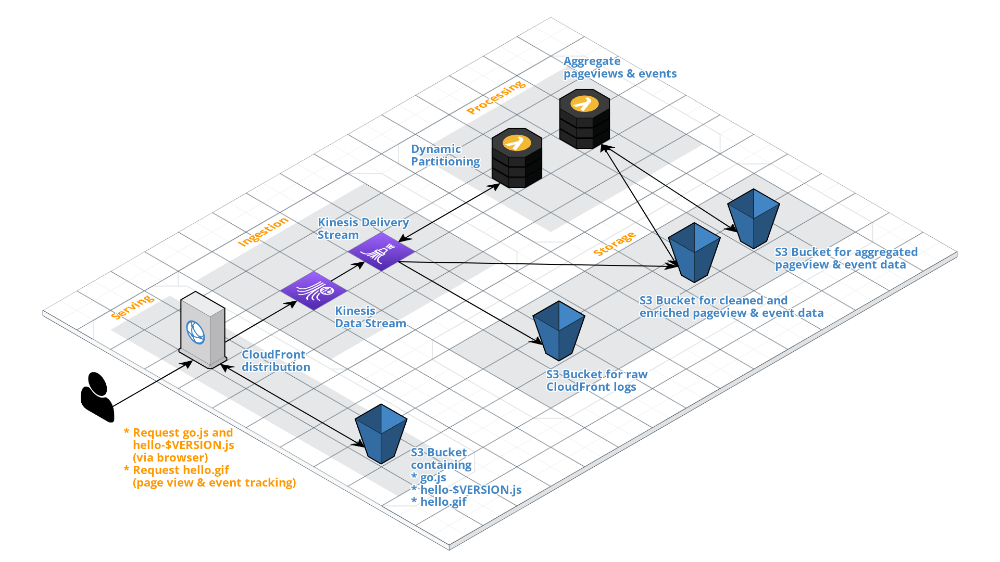

# Analytics backend for Ownstats

## Requirements
You'll need a current v3 version installation of the [Serverless Framework](https://serverless.com) on the machine you're planning to deploy the application from.

Also, you'll have to setup your AWS credentials according to the [Serverless docs](https://www.serverless.com/framework/docs/providers/aws/guide/credentials/).

## Architecture


## Deployment
After you cloned this repository to your local machine and cd'ed in its directory, the application can be deployed like this (don't forget a `npm i` to install the dependencies!):

```bash
$ sls deploy
```

This will deploy the stack to the default AWS region `us-east-1`. In case you want to deploy the stack to a different region, you can specify a `--region` argument:

```bash
$ sls deploy --region eu-central-1
```

The deployment should normally take around 2-5 minutes.
