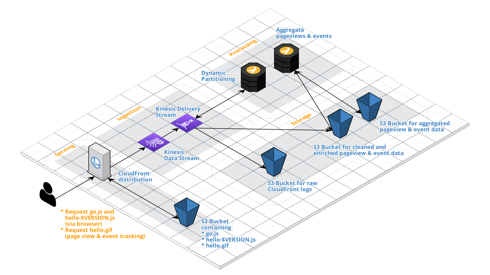

# Backend for OwnStats

## Requirements
You'll need a current v3 version installation of the [Serverless Framework](https://serverless.com) on the machine you're planning to deploy the application from.

Also, you'll have to setup your AWS credentials according to the [Serverless docs](https://www.serverless.com/framework/docs/providers/aws/guide/credentials/).

## Architecture


## Deployment
Use the [OwnStats CLI](https://github.com/ownstats/cli) to deploy the backend. You'll need to create and configure your local installation first. Once you did that, you can deploy the backend like this:

```bash
$ ownstats stack deploy backend
```

This will usually take around 2-5 minutes.
